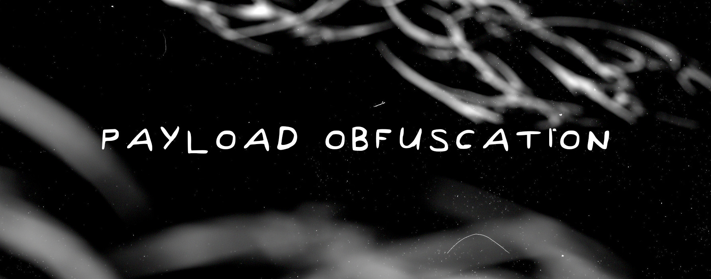

# Payload-Obfuscation

Realizing a powerful malicious application is detected by AV is a crushing setback.

```diff
- .\Malware.exe : Operation did not complete successfully because the file contains a virus or potentially unwanted software.
```

Evading detection is crucial in the domain of cyber. Let's explore how these techniques to mask payloads and challenge even advanced defensive mechanisms.

### Setup
```powershell
git clone https://github.com/SilentisVox.com/Payload-Obfuscation
cd Payload-Obfuscation
cmake .
```

###### Visual Studio
```powershell
cmake . -B build -G "Visual Studio 17 2022"
```

### Usage

```powershell
cd "./AES Encryption"

& "./Encrypt Payload/Encrypt Payload.exe" "./Encrypt Payload/Shellcode.bin" # calc.exe
& "./Decrypt Payload/Decrypt Payload.exe"
```
```powershell
cd "./MAC Obfuscation"

& "./Obfuscate Payload/Obfuscate Payload.exe"
& "./DeObfuscate Payload/DeObfuscate Payload.exe"
```

## Brief Explanation



### What is Obfuscation?

Obfuscation is the action of making something obscure, unclear, or unintelligible, especially code, data, or information, in order to conceal its true purpose or logic. While the functionality remains the same, the clarity and readability are intentionally reduced. This technique is often used in programming, cybersecurity, and digital content protection.

### How does it work with Shellcode?

Well, there are many ways to obfuscate shellcode, but the primary methods used here are AES Encryption and MAC string translation.

#### AES Encryption

What we do here, is generate a random 32 byte key and 16 byte initialization vector (IV). We use this to encrypt given shellcode from a file. We then generate a random byte to xor encrypt both the key and IV. Once completed, we print the encrypted shellcode, encrypted key/IV, and key/IV decryption functions.

#### MAC Obfuscation

For MAC address string translation, we take every 6 bytes of shellcode, and represent them as strings in the MAC address format `FD:3E:CB:3D:38:E4`. Once obfuscated, print the MAC array to the screen.